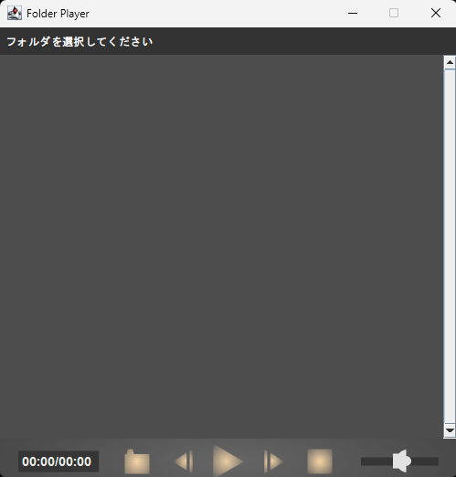

# javafolderplayer

my very old(2018?) java music(mp3) player project archive repo.

## Preparation

Download:

 1. jl1.0.1.jar (<https://ja.osdn.net/projects/sfnet_mp3pl/downloads/lib/jl1.0.1.jar/>)
 2. mp3spi1.9.5.jar (<https://osdn.net/projects/sfnet_mp3pl/downloads/lib/mp3spi1.9.5.jar/>)
 3. tritonus_share-0.3.6.jar (<https://ja.osdn.net/projects/sfnet_mp3pl/downloads/lib/tritonus_share-0.3.6.jar/>)

Place the files at lib/
 e.g.
  lib/hjl1.0.1.jar
  lib/mp3spi1.9.5.jar
  lib/tritonus_share-0.3.6.jar

## Usage

 1. Double click FolderPlayer.jar
 2. Choose folder icon and select a folder that contains your music(mp3).
 3. Play
